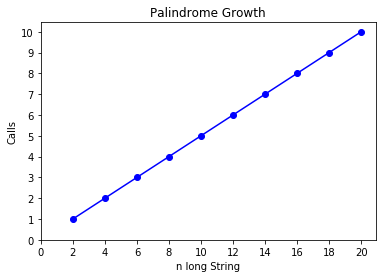

```python
# Palindrome
```


```python
import matplotlib.pyplot as plt
```


```python
def count_calls(counter):
    def decorator(func):
        def wrapper(x):
            counter[x] = 1 if x not in counter else counter[x]+1
            return func(x)
        return wrapper
    return decorator
```


```python
def get_total(counts):
    total= 0
    for key,value in counts.items():
        total+=value
    return total
```


```python
def isPalindrome(s):
    """
    Recursive algorithm.\n
    T(n) = O(n)
    """
    def toChars(s):
        s = s.lower()
        r = ''
        for c in s:
            if c in 'abcdefghijklmnopqrstuvwxyz':
                r = r + c
        return r
    counter = {}
    @count_calls(counter)
    def isPal(s):
        if len(s) <= 1:
            return True
        else:
            return s[0] == s[-1] and isPal(s[1:-1])
    # main func
    return isPal(toChars(s)), counter
```


```python
import random
growth = {}
for i in range(1,11):
    s = ""
    alphabet = "abcdefghijklmnopqrstuvwxyz"
    for j in range(1,i):
        r = random.choice(alphabet)
        s = r+s+r
    print(s)
    result,counts = isPalindrome(s)
    t_i = get_total(counts)
    growth[i*2] = t_i
print('done')
```

    
    xx
    ueeu
    ydccdy
    yciuuicy
    gwxmvvmxwg
    mpvjfccfjvpm
    nfztreggertzfn
    bnxaujsaasjuaxnb
    edulufkqttqkfulude
    done


**Time Complexity** is: **T(n) = n/2**  
with **Growth** of: **O(n)**


```python
values, calls = zip(*sorted(growth.items()))
plt.plot(values, calls,'bo-')
plt.xlabel("n long String")
plt.ylabel('Calls')
plt.xticks(list(range(0,21,2)))
plt.yticks(list(range(0,11,1)))
plt.title('Palindrome Growth')
plt.show()
```




